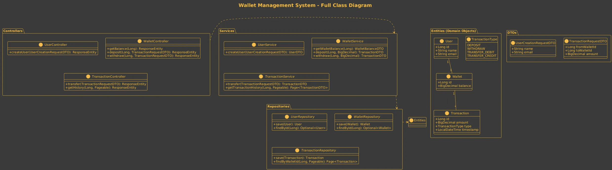
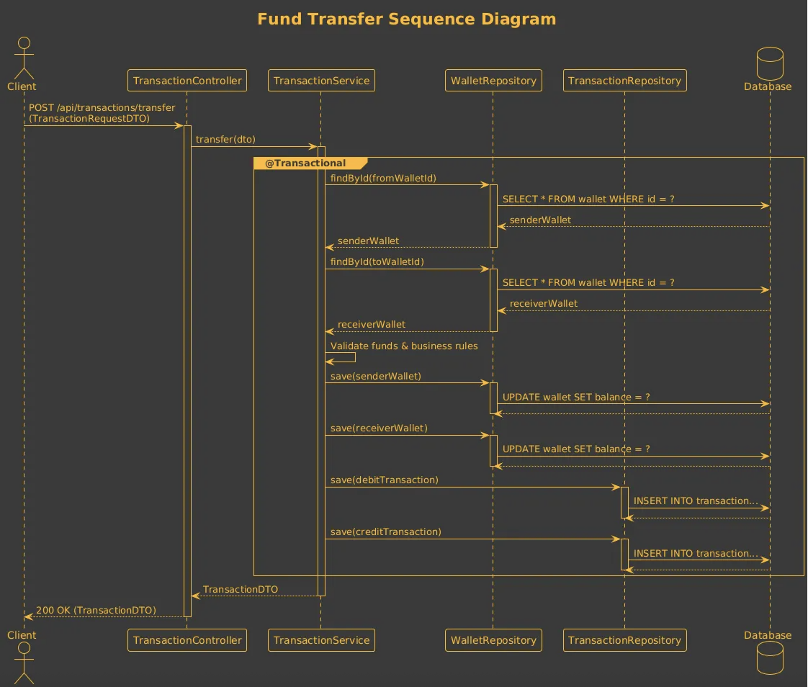
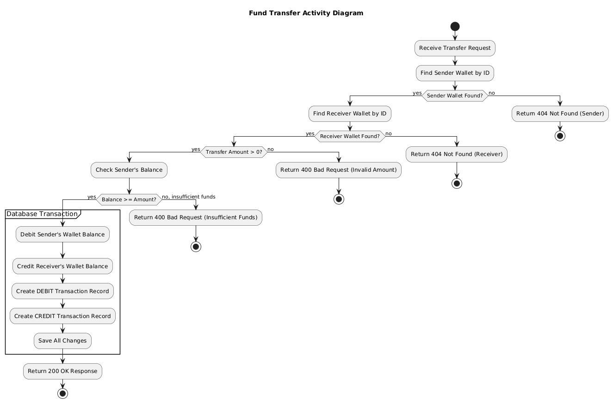

### 1\. Class Diagram

This diagram shows the static structure of the system, including all major classes (Entities, DTOs, Controllers, Services, Repositories) and their relationships. It serves as the primary architectural reference.

#### 📜 Technical Description

  * **Entities**: The core domain models (`User`, `Wallet`, `Transaction`) that are mapped to database tables.
      * A `User` has a one-to-one relationship with a `Wallet`.
      * A `Wallet` has a one-to-many relationship with `Transaction`.
      * `TransactionType` is an `Enum` to define the nature of a transaction (e.g., `DEPOSIT`, `WITHDRAW`, `TRANSFER`).
  * **Repositories**: JPA interfaces (`UserRepository`, etc.) that provide data access methods for the entities.
  * **Services**: The business logic layer. Services orchestrate operations by using one or more repositories. For example, `TransactionServiceImpl` uses `WalletRepository` to update balances and `TransactionRepository` to log the action.
  * **Controllers**: The REST API layer. They handle incoming HTTP requests, validate input using DTOs, call the appropriate service methods, and return HTTP responses.
  * **DTOs (Data Transfer Objects)**: Plain objects used to transfer data between the client and the server. They help decouple the API layer from the domain model and provide a contract for requests and responses. `TransactionRequestDTO`, for example, defines the JSON structure for a transfer request.

-----

### 2\. Sequence Diagrams

Sequence diagrams illustrate how different components interact over time to complete a specific task. They are excellent for understanding the flow of calls for a feature.

#### 📜 Fund Transfer Sequence

This diagram details the step-by-step process of transferring money between two wallets. This is the most critical operation in the system.

  * **Trigger**: A `Client` (e.g., a frontend application or API tool) sends a POST request to `/api/transactions/transfer`.
  * **Flow**:
    1.  The `TransactionController` receives the request and calls the `transfer` method on the `TransactionService`.
    2.  The `TransactionService` begins a database transaction (`@Transactional`).
    3.  It fetches both the sender's and receiver's wallets from the database using the `WalletRepository`.
    4.  It performs business logic checks (e.g., sufficient funds).
    5.  It updates the balance for both wallet objects in memory.
    6.  It creates two `Transaction` entities: one `TRANSFER_DEBIT` for the sender and one `TRANSFER_CREDIT` for the receiver.
    7.  It saves both updated wallets and both new transactions to the database.
    8.  Upon successful completion, an OK response is returned to the client. If any step fails, the `@Transactional` annotation ensures all database changes are rolled back.

-----

### 3\. Activity Diagrams

Activity diagrams show the workflow of a process, highlighting decision points, parallel actions, and the overall flow of control.

#### 📜 Fund Transfer Activity

This diagram visualizes the business workflow for a fund transfer from start to finish, including all success and failure paths.

  * **Start**: The process begins when a transfer request is received.
  * **Validations**: The system performs a series of checks in order:
    1.  Does the sender's wallet exist?
    2.  Does the receiver's wallet exist?
    3.  Is the transfer amount positive?
    4.  Does the sender have sufficient funds?
  * **Failure Paths**: If any validation fails, the process terminates immediately and an appropriate error response (e.g., Not Found, Bad Request) is returned.
  * **Success Path**: If all validations pass, the system proceeds to the core logic:
    1.  Debit the sender's account.
    2.  Credit the receiver's account.
    3.  Record both the debit and credit transactions.
    4.  Commit all changes to the database.
  * **End**: The process concludes by sending a success response.

